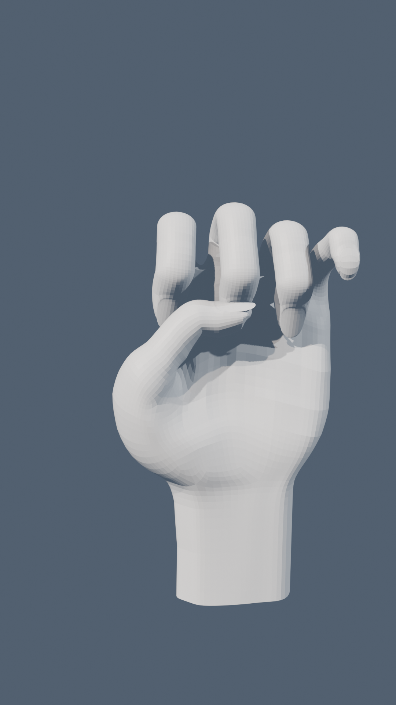

# 🖐️ The Hand - 3D Hand Model & Animations

Blenderで作成した手の3Dモデルに精密なボーン（骨格リギング）を組み込み、**解剖学的に自然な手のひら側への屈曲と10種類以上の多彩なアニメーション**を実装したプロジェクトです。  
スマートフォンやPCのブラウザから360度インタラクティブに動かせる3D Webビューワーを搭載しています。

---

## 🌐 3D Webビューワー（スマホ・PC対応）

ブラウザ上で3Dの手を360度グリグリ回したり、ボタンを押して様々なハンドサインを再生できます！

👉 **[Webビューワーを動かす (GitHub Pages)](https://kam2525-hub.github.io/the-hand-3d/)**

### 🎮 収録アニメーション（レパートリー）
* ✊ **グー (Fist)**: 力強く指を巻き込み、親指でしっかり抑えるリアルな拳
* ✌️ **ピース / チョキ (Peace)**: 人差し指と中指をピンと立てたVサイン
* ✋ **パー (Open)**: 指先まで綺麗に伸びた自然なパー
* 👍 **いいね！ (Thumbs Up)**: 拳を握り、親指を空高く掲げるサムズアップ
* ☝️ **指差し (Pointing)**: 人差し指でピシッと前方を指し示す
* 👌 **OKサイン (OK Sign)**: 親指と人差し指で輪を作り、3本指を美しく広げる
* 🤘 **ロック / キツネ (Rock / Fox)**: 人差し指と小指を立てたメロイックサイン
* 🫰 **指ハート (Finger Heart)**: 親指と人差し指を交差させたトレンドのミニハート
* 🤙 **アロハ / コールミー (Shaka)**: 親指と小指を立てるハワイアン＆通話サイン
* ⌨️ **ピアノ / ウェーブ (Piano Typing)**: 指が順番にカタカタと波打つ流麗な動作
* 👋 **バイバイ (Wave)**: 手首としなやかな指先が左右に揺れる手を振る動作
* ▶️ **全アニメ連続メドレー (Showcase Medley)**: 上記すべてのポーズをスムーズに繋げて連続再生！

### 📱 スマホでの操作
* **スワイプ / ドラッグ**: 視点を360度自由回転
* **ピンチイン / ピンチアウト**: 拡大・縮小
* **下部ボタン**: ワンタップで好きなポーズに即時切り替え

---

## 📁 収録ファイル

| ファイル名 | 説明 |
| :--- | :--- |
| [`index.html`](index.html) | Three.js製 3DインタラクティブWebビューワー（GLBモデル内蔵・オフライン動作可能） |
| [`The_Hand_Animated.glb`](The_Hand_Animated.glb) | ボーン・ウェイト・全11種のアクションがベイクされたglTF/GLB標準モデル |
| [`The_Hand_Animated.blend`](The_Hand_Animated.blend) | Blender 4.5 作業用ファイル（Armatureリグ、サブディビジョン、マテリアル完備） |
| [`The_Hand_Animation.mp4`](The_Hand_Animation.mp4) | スマートフォン縦型（1080×1920, 30fps）でスタジオレンダリングしたメドレー動画 |
| [`qr_code.png`](qr_code.png) | スマホでWebビューワーを開くためのクイックアクセスQRコード |

---

## 🛠️ 技術スタック
* **3D Rigging & Modeling**: Blender 4.5 LTS (Python API `bpy` による自動ウェイト付け・解剖学的位置補正・キーフレーム制御)
* **Render Engine**: Blender EEVEE Next (3-Point Studio Lighting, Subsurface Scattering Skin Shader)
* **Web 3D Viewer**: Three.js, OrbitControls, GLTFLoader
